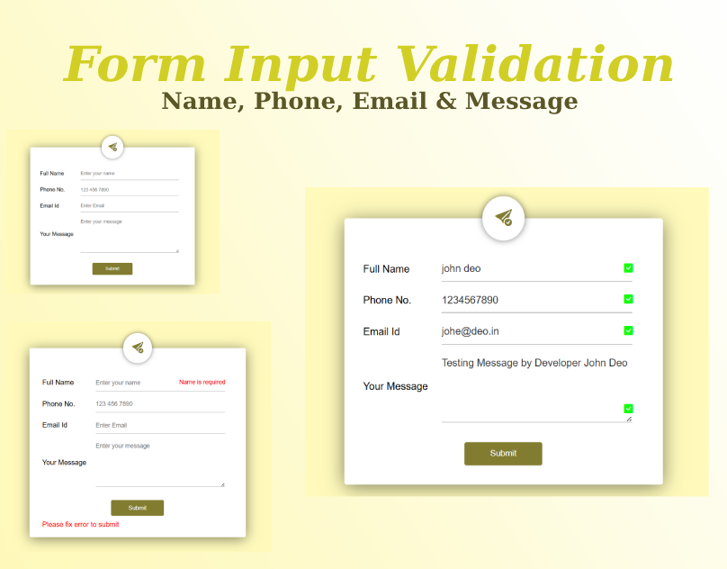

## Complete Form Input Validation: Name, Phone, Email & Message
<a href="https://www.linkedin.com/in/dharmendraverma95/" target="_blank">LinkedIn Profile </a>

<a href="https://www.behance.net/dhirukumar" target="_blank">Behance Profile </a>

## Project Overview
This project demonstrates how to implement complete form input validation for the fields: name, phone, email, and message. It ensures that users provide valid data by using HTML, CSS, and JavaScript to check for correct formatting, required fields, and basic security. This will improve user experience and help ensure accurate data submission on your website or web application.

## Features
- Name Validation: Ensures the user enters a valid name with a minimum character limit.
- Phone Number Validation: Validates phone numbers with proper formatting (e.g., including area codes).
- Email Validation: Verifies that the email entered follows the correct format.
- Message Validation: Ensures the user provides a meaningful message and checks if the field is not empty.
- Real-time Feedback: Displays error messages dynamically as users fill out the form.

###### Lang
<ul>
  <li>HTML5</li>
  <li>CSS3</li>
  <li>Bootstrap Icon</li>
  <li>ChatGPT [For Content]</li>
  <li>ui / ui layout Design</li>
  <li>desgin in Abode XD</li>
</ul>

 
Desktop Design 

 
Desktop UI UX Design 

 
Desktop Design UI UX Layout 

 
Desktop Design 

Cover 
